!!! ЗВІТ НЕ АКТУАЛЬНИЙ !!!
!!! АКТУАЛЬНИЙ ЗВІТ ЗАВАНТАЖЕНО У CLASSROOM !!!
 
 Практичне заняття №2

Дослідження сегментів пам’яті та ASLR

Варіант 11 - Перевірка випадкового розташування сегментів (ASLR)

Виконав Мойсієнко Андрій з групи ТВ-43

***Завдання 1***

Код: 

#include <stdio.h>

#include <time.h>

#include <limits.h>

int main() {

`    `printf("Size of time\_t: %zu bytes\n", sizeof(time\_t));

`    `if (sizeof(time\_t) == 4) {

`        `printf("Likely 32-bit time\_t\n");

`        `printf("Max value: %ld\n", (long)INT\_MAX);

`        `printf("Overflow date: 19 January 2038\n");

`    `} else if (sizeof(time\_t) == 8) {

`        `printf("Likely 64-bit time\_t\n");

`        `printf("Very large range (~292 billion years)\n");

`    `}

`    `return 0;

}

Результат роботи:

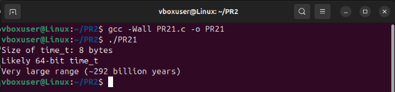

Пояснення:\
У системі використовується 64-бітний тип time\_t. Це означає, що переповнення часу практично неможливе. Проблема 2038 року актуальна лише для 32-бітних систем.

***Завдання 2***

**Базова програма:**\
#include <stdio.h>

int main() {

`    `printf("Hello, world!\n");

`    `return 0;

}

Результат:

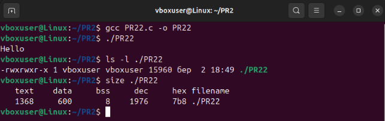

**Додаємо: int global\_array[1000];**

Тоді код:

#include <stdio.h>

int global\_array[1000];

int main() {

`    `printf("Hello, world!\n");

`    `return 0;

}

І результат:

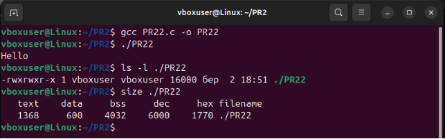

Тут :

- Збільшився сегмент BSS
- Розмір файлу НЕ змінився

**Далі додаємо ініціалізований масив. Код такий:**

#include <stdio.h>

int global\_array[1000] = {1};

int main() {

`    `printf("Hello, world!\n");

`    `return 0;

}

Результат:

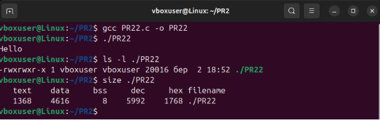

Тут:

- Масив перейшов у сегмент DATA
- Розмір файлу ЗБІЛЬШИВСЯ

**Тепер створюємо локальні масиви. Код:** 

#include <stdio.h>

void test() {

`    `int local\_array1[10000];

`    `int local\_array2[10000] = {1};

}

int main() {

`    `test();

`    `printf("Hello\n");

`    `return 0;

}

Результат:

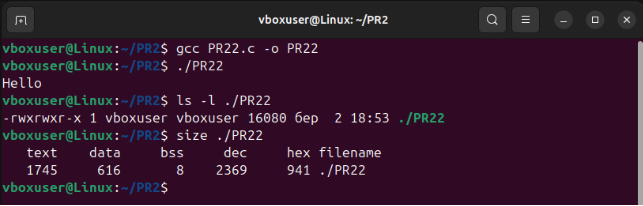

Тут:

- Файл майже не зміниться
- BSS не зміниться
- DATA не зміниться
- бо це стек, а не сегменти файлу

**Тепер оптимізуємо:**

Базова:

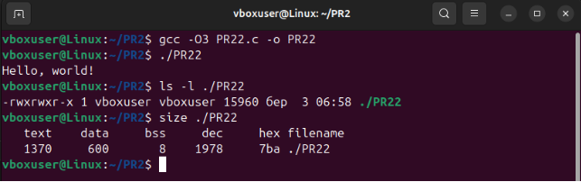

З не ініціалізованим масивом:

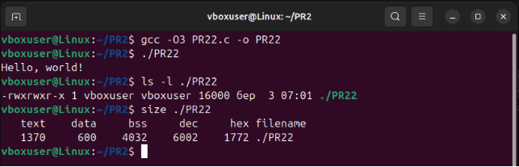

З ініціалізованим масивом:

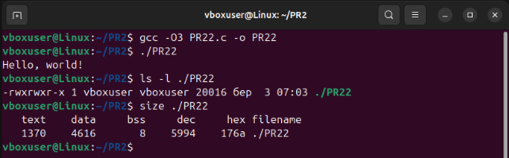

З локальними масивами:

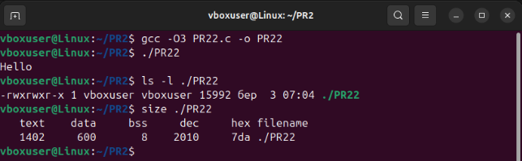

Висновки:

- -g → збільшує файл
- -O3 → зменшує text сегмент
- DATA і BSS не змінюються

***Завдання 3***

Код:

#include <stdio.h>

#include <stdlib.h>

int global\_var = 10;

int global\_uninit;

int main() {

`    `int local\_var = 5;

`    `int \*heap\_var = malloc(sizeof(int));

`    `printf("Text segment: %p\n", main);

`    `printf("Data segment: %p\n", &global\_var);

`    `printf("BSS segment: %p\n", &global\_uninit);

`    `printf("Heap segment: %p\n", heap\_var);

`    `printf("Stack segment: %p\n", &local\_var);

`    `free(heap\_var);

`    `return 0;

}

Результат:

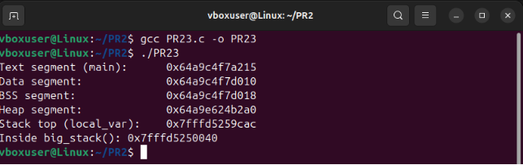

***Завдання 4***

Не працює. Є питання

***Завдання 5***

**Теоретичне пояснення**

IP (Instruction Pointer) — це спеціальний регістр процесора, який зберігає адресу наступної інструкції, що буде виконана.

У 64-бітній архітектурі x86 цей регістр називається RIP.

IP автоматично оновлюється після виконання кожної інструкції та забезпечує послідовність виконання програми.

Стек — це область пам’яті, що використовується для:

- збереження адрес повернення при виклику функцій;
- збереження локальних змінних;
- передачі параметрів функціям.

Стек не керує виконанням кожної інструкції програми. Він використовується лише при викликах процедур та поверненні з них.

**Приклад роботи IP та стеку**

Розглянемо просту програму.

Код:

#include <stdio.h>

void foo() {

`    `printf("Hello\n");

}

int main() {

`    `foo();

`    `return 0;

}

При виклику foo() процесор виконує інструкцію call foo.

У цей момент:

1. Адреса наступної інструкції (тобто після call) записується у стек.
1. IP (RIP) змінюється на адресу початку функції foo.
1. Після завершення foo() виконується інструкція ret.
1. Адреса повернення зі стеку записується назад у IP.
1. Виконання продовжується з цієї адреси.

Отже, стек лише тимчасово зберігає адресу повернення. Реальне керування виконанням здійснюється через IP.

**Чому стек не може замінити IP?**

Розглянемо звичайну послідовність інструкцій:

mov eax, 5\
add eax, 2\
sub eax, 1

Під час виконання цих інструкцій стек не використовується.\
Однак процесор повинен послідовно переходити від однієї інструкції до іншої.\
Це забезпечується саме IP, який автоматично змінюється після кожної інструкції.

Якби IP не існував, процесор не знав би, яку інструкцію виконувати наступною.

**Приклад з циклом**

Розглянемо нескінченний цикл:

while (1) {\
`    `printf("Hi");\
}

У цьому випадку використовується команда переходу (jmp), яка змінює значення IP.\
Стек при цьому не змінюється, оскільки немає викликів функцій.

Отже:

- керування циклом здійснюється через IP;
- стек у цьому процесі участі не бере.

**Апаратний аспект**

IP є апаратним регістром процесора.\
Стек — це лише область пам’яті.

Процесор фізично не може виконувати інструкції без регістра IP, оскільки саме він визначає адресу наступної інструкції.

**Висновок**

IP (Instruction Pointer) не може бути замінений стеком.

Стек зберігає лише адреси повернення при виклику функцій, тоді як IP керує виконанням кожної інструкції програми, включаючи послідовне виконання, переходи та цикли.

Отже, стек не може виконувати функцію лічильника команд.

***Завдання по варіанту***

**Що таке ASLR**

ASLR (Address Space Layout Randomization) — механізм безпеки, що випадково змінює розташування сегментів:

- стеку
- купи
- бібліотек
- сегменту коду

Код:

#include <stdio.h>

#include <stdlib.h>

int global\_var = 42;

int main() {

`    `int local\_var = 10;

`    `int \*heap\_var = malloc(sizeof(int));

`    `printf("Address of main:        %p\n", main);

`    `printf("Address of global\_var:  %p\n", &global\_var);

`    `printf("Address of heap\_var:    %p\n", heap\_var);

`    `printf("Address of local\_var:   %p\n", &local\_var);

`    `free(heap\_var);

`    `return 0;

}

Результат:

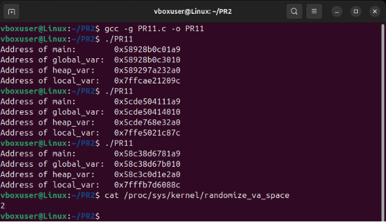

**Перевірка статусу ASLR**

Команда:** cat /proc/sys/kernel/randomize\_va\_space

Можливі значення:

- 0 — вимкнено
- 1 — частково
- 2 — повністю

Висновок:

- DATA сегмент зберігається у файлі.
- BSS не займає місце у файлі.
- Оптимізація впливає на TEXT.
- ASLR змінює адреси при кожному запуску.
- Це критично важливий механізм захисту від експлойтів.

